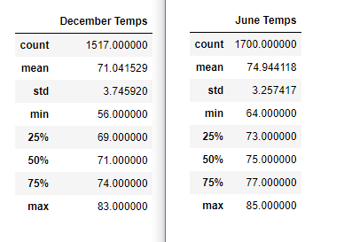
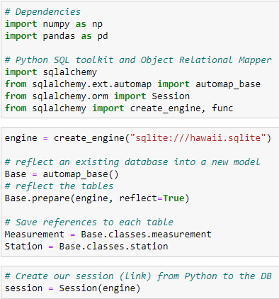
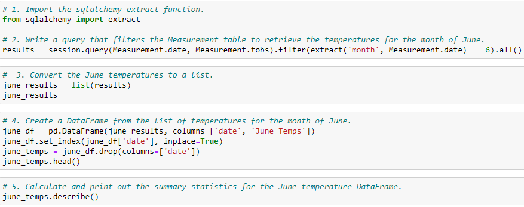
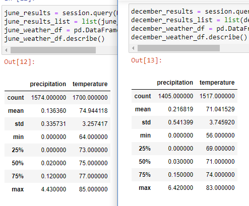
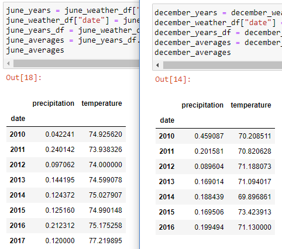

# An Analysis of Weather Data Through SQLite and SQLalchemy

### *File Links*:
- Jupyter Notebook File: [SurfsUp_Challenge](SurfsUp_Challenge.ipynb)
- SQLite File: [hawaii](hawaii.sqlite)

## **Overview**:
This analysis was conducted to determine the feasibility of establishing a business in Oahu, Hawaii that focuses on selling surfing goods and ice cream to the local area. By reading and analyzing relevant weather data for the area through Python, the chances of this area being a profitable enterprise based on the goods expected to be provided are much easier to determine when considering the trends shown in the data. Not only does this analysis show the trends in weather data for the area considered, it also shows the efficiency of SQLite databases and SQLalchemy's tools when applied through Python code. Based on the code included in the Jupyter Notebook file above, this analysis can be easily readjusted for use in a variety of different areas with the intent of finding preferable trends in those weather patterns.

## **Results**:
The results of this analysis were very useful for achieving the goal of this project, which was to determine trends in the weather in Oahu, Hawaii and the liklihood of a business that sells surfing goods and ice cream becoming profitable. Based on the statistical results from this analysis, three main conclusions have been reached:
1. Oahu, Hawaii has a comfortable average temperature and a moderately higher maximum temperature - with neither values giving the impression that people would avoid the area at either point in the year for being too hot or too cold. As shown in the image below, the max temperature values are very close to each other, with neither breaking into the 90 degrees Fahrenheit level. In addition to this, the minimum temperatures vary slightly more, but never get below 55 degrees Fahrenheit. Although the minimum temperatures would likely be too cold for most people to surf in both cases, the fact that the temperatures never get near freezing temperatures means people are not that likely to avoid ice cream as much due to cold weather.

### *Statistical Summaries Comparison*
- 

2. The statistical summaries of the dataframes created for weather observations in June and December had very little variation, showing the location provides a comfortable level of certainty that the previous conclusion will hold true. This means a business will not have to worry too much about fluctuation in sales due to the weather throughout the year.

3. A third conclusion is how simple the code that imports the SQLite file's data and processes it into a usable database is. The small amount of code needed to create the summaries for both months makes it clear how useful the SQLalchemy tools and SQLite databases are for simplifying the process of accessing and analyzing values from a database. As shown in the images below, the amount of code needed to read the SQLite file and the amount of code needed to analyze it are around the same size and less than 10 lines for each section. This simplicity also makes it clear that reusing this code for other cases of weather analysis is very simple and easy to do.

### *Size of Code Needed*



## **Summary**:
The results from this analysis gave some great insight into the weather trends for the location in Hawaii and showed there are some favorable statistics to indicate starting this type of business there would be profitable. The biggest issue with this data, though, is that it is limited to only the temperature variations and does not consider any other weather data that may have been gathered for the area. The fact that both June and December were considered is helpful, as they often account for the biggest weather changes between Winter and Summer, meaning the date sections can be retained when searching for greater amounts of data in the SQLite file. 

To gather a larger amount of weather data for both June and December, a new query would need to be run to extract the relevant data from the SQLite file's database. In addition to the temperature records, the precipitation values recorded on each date available would also help in determining the potential success of the business in that area in Hawaii. By writing a new query for each month that adds onto the previous one, the precipitation values can be extracted along with the temperature records. The new queries per month are:
```
- june_results = session.query(Measurement.date, Measurement.prcp, Measurement.tobs).filter(extract('month', Measurement.date) == 6).all()
- december_results = session.query(Measurement.date, Measurement.prcp, Measurement.tobs).filter(extract('month', Measurement.date) == 12).all()
```
These two queries will return values that can be converted into a Pandas dataframe with the same code line as for the temperature, but adding another column label for the relevant data column that is filled by the precipitation records. By using these values for both months a summary can be created that gives greater insight into the weather trends in Oahu during those months. A comparison of the two summary tables is included in the screenshot below, with the variation between minimum and maximum recorded precipitation levels being quite high, but the overall average amount being very low for both months considered.



In addition to the data that the new queries can provide, a different analysis to add greater perspective on the location's weather can be run when considering these values across the different years' records available in the SQLite database. By grouping the values by year a comparison for each month's average temperature and precipitation records can be shown by year and provide some perspective in how confidently the results above can be used for deciding on establishing this business. Based on the handful of years available, the average temperatures seem to fluctuate but the only clear trend is in the more recent years for June going up slightly. In addition to that, the precipitation values show some clear cases of outliers among the averages available, which gives a clearer idea of how unpredictable the weather can be in the area. The two tables with these averages are included below.


